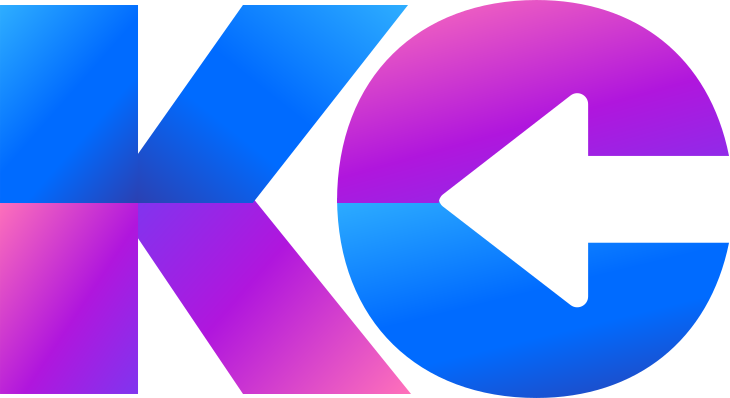

<a name="readme-top"></a>

<div align="center">

  
  <br/>

  <h3><b>KC PORTFOLIO</b></h3>

</div>


# 📗 Table of Contents

- [📖 About the Project](#about-project)
  - [🛠 Built With](#built-with)
    - [Tech Stack](#tech-stack)
    - [Key Features](#key-features)
  - [🚀 Live Demo](#live-demo)
- [💻 Getting Started](#getting-started)
  - [Setup](#setup)
  - [Prerequisites](#prerequisites)
  - [Install](#install)
  - [Usage](#usage)
  - [Run tests](#run-tests)
  - [Deployment](#deployment)
- [👥 Authors](#authors)
- [🔭 Future Features](#future-features)
- [🤝 Contributing](#contributing)
- [⭐️ Show your support](#support)
- [🙏 Acknowledgements](#acknowledgements)
- [❓ FAQ (OPTIONAL)](#faq)
- [📝 License](#license)


# 📖 KC Portfolio <a name="about-project"></a>


**KC Portfolio** is portfolio page that illustrate my skills in designs using the FIGMA template. This is also a good application in using flexbox and grid to layout the elements of the page. 

## 🛠 Built With <a name="built-with"></a>

### Tech Stack <a name="tech-stack"></a>


<details>
  <summary>HTML</summary>
</details>

<details>
  <summary>CSS</summary>
</details>

<details>
  <summary>FIGMA</summary>
</details>


### Key Features <a name="key-features"></a>


- **Create a page using the FIGMA design**
- **Use flexbox and grid for layout**
- **Use version control**

<p align="right">(<a href="#readme-top">back to top</a>)</p>


## 🚀 Live Demo <a name="live-demo"></a>


- [Live Demo Link](https://kccendana.github.io/portfolio_project/)

<p align="right">(<a href="#readme-top">back to top</a>)</p>


## 💻 Getting Started <a name="getting-started"></a>


### Prerequisites

In order to run this project you need text editor like VSCode.


### Setup

Clone this repository to your desired folder:


```
  git clone git@github.com:Kccendana/portfolio_project.git
  cd portfolio_project
```


### Usage

To run the project, open it through live server or double click the index.html


<p align="right">(<a href="#readme-top">back to top</a>)</p>


## 👥 Author <a name="authors"></a>


👤 **Katherine Cendana**

- GitHub: [@Kccendana](https://github.com/Kccendana)
- Twitter: [@kc_telyn](https://twitter.com/kc_telyn)
- LinkedIn: [LinkedIn](https://www.linkedin.com/in/katherinecendana/)

👤 Sudipta Majumder

- GitHub: [@githubhandle](https://github.com/Tupai566)
- Twitter: [@twitterhandle](https://twitter.com/imtupai566)
- LinkedIn: [LinkedIn](https://www.linkedin.com/in/tupai-mazumder-16109a243/)


<p align="right">(<a href="#readme-top">back to top</a>)</p>


## 🔭 Future Features <a name="future-features"></a>


- [ ] **Add different sections of the portfolio**
- [ ] **Add animations to the elements**
- [ ] **Make the website responsive**

<p align="right">(<a href="#readme-top">back to top</a>)</p>


## 🤝 Contributing <a name="contributing"></a>

Contributions, issues, and feature requests are welcome!

Feel free to check the [issues page](https://github.com/Kccendana/portfolio_project/issues).

<p align="right">(<a href="#readme-top">back to top</a>)</p>


## ⭐️ Show your support <a name="support"></a>

If you like this project feel free to follow this project and hit the star.

<p align="right">(<a href="#readme-top">back to top</a>)</p>


## 🙏 Acknowledgments <a name="acknowledgements"></a>


I would like to thank Microverse for helping me improve my skills in web design.

<p align="right">(<a href="#readme-top">back to top</a>)</p>


## ❓ FAQ (OPTIONAL) <a name="faq"></a>


- **How can I get a copy of the project and save it in my desktop?**

  - You can download the whole folder and save it in your computer or you can clone this repository.


<p align="right">(<a href="#readme-top">back to top</a>)</p>

<!-- LICENSE -->

## 📝 License <a name="license"></a>

This project is [MIT](MIT.md) licensed.


<p align="right">(<a href="#readme-top">back to top</a>)</p>
